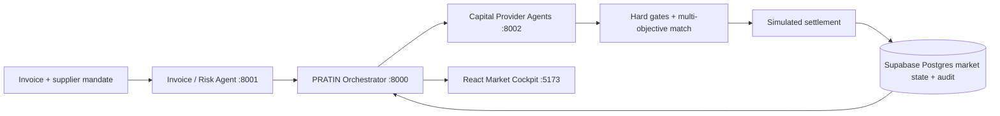

# PRATIN — Procurement Receivables & Agentic Trade Invoice Network

> **A competitive capital-allocation market for supply-chain working capital.**

PRATIN turns a verified invoice into a financing opportunity evaluated by autonomous capital-provider agents with different liquidity, risk appetites, expected returns, sector preferences and portfolio constraints. Competing offers are filtered against supplier hard requirements and ranked on total suitability—not headline interest alone—before simulated settlement changes the next market outcome.

**The hackathon moment:** Astra Bank advertises the lowest rate, but cannot advance the required ₹8 lakh or settle within 48 hours. VegaFlow NBFC wins because it satisfies the complete mandate. Its liquidity then falls, and the next invoice clears to a different provider.

> All data, verification and settlement are synthetic. No real underwriting, GST/KYC verification, financial advice or fund movement occurs.

## Why this is not a loan comparison site

PRATIN is stateful and two-sided. Supplier constraints are hard gates; providers independently decide whether to participate; risk-adjusted return and portfolio capacity affect their actions; every score has factor-level reasons; and accepting an offer mutates provider liquidity/exposure. The next ranking therefore changes.

## Architecture



The browser talks only to the orchestrator. HTTP service responses are validated against strict shared Pydantic contracts. `required`, `auto` and `fixture` modes make live service provenance or degradation visible.

| Component | Responsibility | Port |
|---|---|---:|
| PRATIN core | Orchestration, matching, Supabase/Postgres persistence, settlement, metrics, audit | 8000 |
| Invoice & Risk Agent | Synthetic verification, uncertainty and explainable deterministic risk | 8001 |
| Capital Market Agents | Discovery, provider constraints and differentiated offers | 8002 |
| Market Cockpit | Live competition, explanations and reallocation demo | 5173 |

## Demo startup

Prerequisite: Docker Desktop / Docker Engine with Compose v2. For the final integrated presentation, set `PRATIN_DATABASE_BACKEND=supabase` and `SUPABASE_DATABASE_URL` in an uncommitted `.env`, then run:

```bash
docker compose up --build
```

Open [http://127.0.0.1:5173](http://127.0.0.1:5173), select **Run flagship market**, accept the recommendation, then select **Run next allocation**. API docs are available on ports 8000, 8001 and 8002 at `/docs`.

Without those Supabase variables, the same command deliberately starts the resilient SQLite offline fallback and labels it in the cockpit. Use that only as the presentation backup, not as proof of Supabase integration.

## Local development

```powershell
py -3.11 -m venv .venv
.\.venv\Scripts\Activate.ps1
python -m pip install -r requirements.txt
corepack pnpm --dir frontend install
```

Start four terminals:

```powershell
python -m uvicorn services.invoice_risk.app:app --port 8001
python -m uvicorn services.capital_market.app:app --port 8002
$env:PRATIN_INTEGRATION_MODE="required"; python -m uvicorn backend.app.main:app --port 8000
corepack pnpm --dir frontend dev
```

For a completely offline, deterministic presentation set `PRATIN_INTEGRATION_MODE=fixture`. `auto` prefers services and visibly reports `DEGRADED_FIXTURE` when it falls back.

### Supabase persistence

The primary demo configuration uses a private Supabase Postgres schema. Apply `supabase/migrations/20260828091405_create_pratin_marketplace.sql`, then configure the **core backend only**:

```powershell
$env:PRATIN_DATABASE_BACKEND="supabase"
$env:SUPABASE_DATABASE_URL="<server-only pooled or direct Postgres URL>"
```

Get the URL from **Supabase Dashboard → Connect**. Never expose it through `VITE_*`, commit it, or send it to the browser. When the URL is absent, local development and tests use the explicit SQLite offline fallback; the cockpit labels that state `SQLITE OFFLINE` rather than implying Supabase is active.

## API surface

| Method | Endpoint | Purpose |
|---|---|---|
| `POST` | `/api/opportunities` | Admit an invoice and supplier mandate |
| `POST` | `/api/opportunities/{id}/run-market` | Verify, assess risk, discover, offer and match |
| `POST` | `/api/opportunities/{id}/accept/{offer_id}` | Idempotent simulated settlement |
| `GET` | `/api/opportunities` | Durable opportunity history |
| `GET` | `/api/providers` | Current liquidity and portfolio exposure |
| `GET` | `/api/settlements` | Simulated settlement ledger |
| `GET` | `/api/audit` | Explainable event trail |
| `GET` | `/api/platform/metrics` | Data-derived marketplace metrics |
| `POST` | `/api/demo/reset` | Restore deterministic synthetic state |

## Matching policy

Offers first fail hard constraints: financing floor, settlement ceiling, supplier cost ceiling, risk appetite, liquidity, ticket size and portfolio concentration. Eligible offers are scored by the canonical `matching-policy-1.1-demo` weights in `backend/app/matching.py`: usable capital 28%, total effective cost 32%, settlement speed 16%, tenor 8%, provider risk-adjusted return 8% and remaining liquidity 8%. The weights sum to 100%; every component is returned to the UI with its score, weight, weighted contribution and backend explanation. These are demonstration policy parameters, not a production credit model.

## Verification

```powershell
python -m pytest -q
corepack pnpm --dir frontend test
corepack pnpm --dir frontend run build
```

Current baseline: **40 environment-independent Python tests**, **6 additional Postgres settlement/security tests in the database-backed CI job**, **8 frontend tests**, and the production build pass. Coverage includes uncertainty, provider differentiation, risk appetite, strict integration failures, deterministic ranking, “lowest rate loses,” atomic settlement rollback, idempotent replay, stale provider and orchestration state, Supabase configuration safety, liquidity mutation, visible provenance, cockpit failure states and retained reallocation history.

With all three Python services running in `required` mode, `python -m backend.app.integration_check` verifies the live HTTP path and asserts that the second invoice moves to a different provider.

## Repository map

```text
backend/                 Core API, integrations, matching, Supabase/Postgres + SQLite fallback
contracts/               Strict shared Pydantic contracts
services/invoice_risk/   Pratham-owned verification and risk agent
services/capital_market/ Nitin-owned provider agents and offer generation
frontend/                Pratyush-owned React market cockpit
docs/                    Architecture, integration, demo, team and judge pack
supabase/migrations/     Private marketplace schema tracked in Supabase migration history
.github/workflows/       Deterministic CI
docker-compose.yml       Health-checked four-service stack
```

## Built vs future

**Built:** synthetic rule verification; uncertainty; deterministic risk; differentiated provider agents; two-sided constraints; total effective cost; explainable ranking; private Supabase Postgres persistence with SQLite offline fallback; atomic simulated settlement; audit; reallocation; fixture/auto/required modes; responsive market UI; tests; Docker; CI.

**Future production work:** GST/e-invoice and KYC/KYB integrations, bureau/open-banking data, bank/NBFC APIs, event streaming, OIDC/RBAC, encryption and key management, fraud detection, digital signatures, regulated settlement rails, model governance, fairness monitoring, privacy controls and production-calibrated policies.

PRATIN is named for Pratyush, Pratham and Nitin. See [the team guide](docs/team-start-here.md) and [the 2–3 minute demo](docs/demo-script.md).
