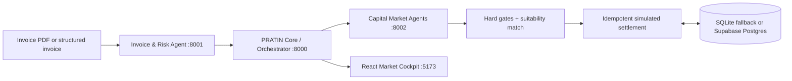

# PRATIN — Procurement Receivables & Agentic Trade Invoice Network

> From trade-invoice PDF to an explainable, stateful financing market.

PRATIN is a full-stack demonstration of supply-chain working-capital financing. It accepts a structured invoice or an invoice PDF, performs deterministic synthetic verification and risk evaluation, asks autonomous capital providers to price and constrain the opportunity, then ranks the eligible offers. Accepting an offer simulates an atomic settlement that changes provider liquidity and exposure—so the next allocation can have a different winner.

> **Important:** all invoices, verification, risk decisions, offers, persistence, and settlement are synthetic. PRATIN does not perform real underwriting, GST/KYC checks, credit decisions, financial advice, or fund movement.

## Why PRATIN

- **PDF invoice intake** — validates a PDF (up to 10 MB), extracts embedded text in memory, shows extracted fields/confidence/missing data, and writes a durable ledger entry.
- **Explainable risk** — deterministic verification, uncertainty labels, reason codes, and factor-level risk decisions.
- **Autonomous providers** — each agent runs `OBSERVE → EVALUATE → CONSTRAIN → DECIDE → PRICE → EXPLAIN → ACT` according to its own liquidity, risk appetite, sector fit, ticket size, and portfolio cap.
- **Hard constraints first** — lowest rate does not win if it cannot meet the amount, timing, cost, or policy requirements.
- **Stateful simulation** — settlement is atomic and replay-safe; changed provider state influences the following market.
- **Truthful provenance** — live service, fixture, degraded fallback, and SQLite/Postgres state are labelled in the cockpit.

## Architecture



| Component | Responsibility | Port |
|---|---|---:|
| Core API | Orchestration, matching, persistence, settlement, audit, metrics, PDF admission | 8000 |
| Invoice & Risk Agent | PDF extraction, synthetic verification, deterministic risk evaluation | 8001 |
| Capital Market Agents | Provider analysis, pricing, offers, and agent reasoning | 8002 |
| Market Cockpit | Responsive React demo UI | 5173 |

The cockpit uses Core for marketplace actions. Its Capital Agents tab calls the capital-market service's local `/analysis` endpoint to render agent reasoning.

## Run with Docker

Requires Docker Desktop (or Docker Engine) with Compose v2.

```bash
docker compose up --build
```

Open [http://127.0.0.1:5173](http://127.0.0.1:5173).

The default Compose setup uses required HTTP integration between services and persistent SQLite state. API docs:

- [Core docs](http://127.0.0.1:8000/docs)
- [Invoice & Risk docs](http://127.0.0.1:8001/docs)
- [Capital Market docs](http://127.0.0.1:8002/docs)

### Optional Supabase Postgres

Apply `supabase/migrations/20260828091405_create_pratin_marketplace.sql`, then create an uncommitted `.env`:

```env
PRATIN_DATABASE_BACKEND=supabase
SUPABASE_DATABASE_URL=<server-only-pooled-or-direct-Postgres-URL>
```

Never commit this URL, expose it through `VITE_*`, or send it to the browser. Without it, PRATIN deliberately uses SQLite and shows that state in the UI.

## Local development

```powershell
py -3.11 -m venv .venv
.\.venv\Scripts\Activate.ps1
python -m pip install -r requirements.txt
corepack pnpm --dir frontend install
```

Run each service in a separate terminal:

```powershell
python -m uvicorn services.invoice_risk.app:app --port 8001
python -m uvicorn services.capital_market.app:app --port 8002
$env:PRATIN_INTEGRATION_MODE="required"; python -m uvicorn backend.app.main:app --port 8000
corepack pnpm --dir frontend dev
```

Use `PRATIN_INTEGRATION_MODE=fixture` for a fully deterministic in-process demo. `auto` prefers services and visibly labels fallback results `DEGRADED_FIXTURE`.

## Presentation flow

1. In **Market pulse**, select **Run flagship market**.
2. Inspect the offer explanations. Astra may quote lower pricing but cannot meet the supplier mandate; VegaFlow wins the complete request.
3. Select **Accept & simulate settlement** to atomically update liquidity and exposure.
4. Select **Run next allocation**. The updated market state changes the recommendation to Meridian.
5. In **Risk ledger**, inspect durable evaluations or upload a text-based invoice PDF. The result shows fields, confidence, missing data, risk factors, provenance, and PDF filename.
6. In **Capital agents**, inspect every provider's hard gates, attractiveness, pricing decomposition, terms, state, and reasons.

## API highlights

| Method | Endpoint | Purpose |
|---|---|---|
| `POST` | `/api/opportunities` | Admit a structured invoice and financing requirements |
| `POST` | `/api/invoices/parse-pdf` | Validate, parse, evaluate, and persist an invoice PDF |
| `POST` | `/api/opportunities/{id}/run-market` | Verify, assess risk, generate offers, and match |
| `POST` | `/api/opportunities/{id}/accept/{offer_id}` | Idempotent simulated settlement |
| `GET` | `/api/opportunities` | Durable market history |
| `GET` | `/api/risk-ledger` | Explainable evaluations, including PDF metadata |
| `GET` | `/api/providers` | Current provider liquidity and exposure |
| `GET` | `/api/audit` | Event trail |
| `POST` | `:8002/analysis` | Detailed provider-agent reasoning |

## PDF boundaries

PDF parsing is intentionally bounded: only PDFs are accepted, files are limited to 10 MB, text is extracted in memory, and there is no OCR. Scanned/image-only or encrypted PDFs may return `PDF_TEXT_UNREADABLE`, `PDF_EMPTY`, or `PDF_INVALID`; PRATIN reports that result instead of fabricating fields.

## Verification

```powershell
python -m pytest -q
corepack pnpm --dir frontend test
corepack pnpm --dir frontend run build
python -m backend.app.integration_check
docker compose config --quiet
```

Current baseline: **80 passing Python tests**, **6 Postgres-only tests skipped unless `PRATIN_TEST_POSTGRES_URL` is configured**, and **8 passing frontend tests**. Coverage includes PDF validation/parsing, risk explanation, provider-agent constraints and pricing, matching, replay-safe settlement, rollback, stale-state protection, persistence selection, and the end-to-end two-allocation flow.

## Repository map

```text
backend/                 Core FastAPI app, matching, persistence, settlement
contracts/               Strict shared Pydantic models
services/invoice_risk/   PDF parser, verification, deterministic risk engine
services/capital_market/ Autonomous provider-agent pipeline and market regimes
frontend/                React cockpit: Market pulse, Opportunities, Risk ledger, Capital agents
supabase/migrations/     Marketplace schema migration
docs/                    Architecture, demo script, integration and judging notes
```

## Production roadmap

PRATIN is a demonstrator, not a production finance platform. Real deployment requires regulated data/settlement integrations, KYC/KYB and e-invoice validation, fraud controls, RBAC, encryption and key management, observability, model governance, privacy controls, and legal/compliance review.

Named for Pratyush, Pratham, and Nitin. See the [team guide](docs/team-start-here.md), [architecture notes](docs/architecture.md), and [demo script](docs/demo-script.md).
