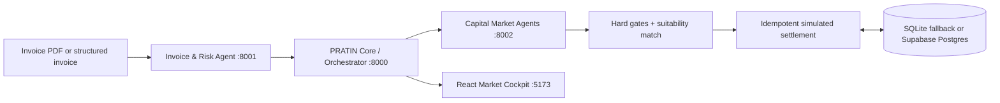

# PRATIN — Procurement Receivables & Agentic Trade Invoice Network

> From trade-invoice PDF to an explainable, stateful financing market.

PRATIN is a full-stack demonstration of supply-chain working-capital financing. It accepts a structured invoice or an invoice PDF, performs deterministic synthetic verification and risk evaluation, asks autonomous capital providers to price and constrain the opportunity, then ranks the eligible offers. Accepting an offer simulates an atomic settlement that changes provider liquidity and exposure—so the next allocation can have a different winner.

> **Important:** all invoices, verification, risk decisions, offers, persistence, and settlement are synthetic. PRATIN does not perform real underwriting, GST/KYC checks, credit decisions, financial advice, or fund movement.

## Why PRATIN

- **PDF invoice intake** — validates a PDF (up to 10 MB), extracts embedded text in memory, shows extracted fields/confidence/missing data, and writes a durable ledger entry.
- **Explainable risk** — deterministic verification, uncertainty labels, reason codes, and factor-level risk decisions.
- **Autonomous providers** — each agent runs `OBSERVE → EVALUATE → CONSTRAIN → DECIDE → PRICE → EXPLAIN → ACT` according to its own liquidity, risk appetite, sector fit, ticket size, and portfolio cap.
- **Hard constraints first** — lowest rate does not win if it cannot meet the amount, timing, cost, or policy requirements.
- **Stateful simulation** — settlement is atomic and replay-safe; changed provider state influences the following market.
- **Truthful provenance** — live service, fixture, degraded fallback, and SQLite/Postgres state are labelled in the cockpit.

## Architecture



| Component | Responsibility | Port |
|---|---|---:|
| Core API | Orchestration, matching, persistence, settlement, audit, metrics, PDF admission | 8000 |
| Invoice & Risk Agent | PDF extraction, synthetic verification, deterministic risk evaluation | 8001 |
| Capital Market Agents | Provider analysis, pricing, offers, and agent reasoning | 8002 |
| Market Cockpit | Responsive React demo UI | 5173 |

The cockpit uses Core for marketplace actions. Its Capital Agents tab calls the capital-market service's local `/analysis` endpoint to render agent reasoning.

## Run with Docker

Requires Docker Desktop (or Docker Engine) with Compose v2.

```bash
docker compose up --build
```

Open [http://127.0.0.1:5173](http://127.0.0.1:5173).

The default Compose setup uses required HTTP integration between services and persistent SQLite state. API docs:

- [Core docs](http://127.0.0.1:8000/docs)
- [Invoice & Risk docs](http://127.0.0.1:8001/docs)
- [Capital Market docs](http://127.0.0.1:8002/docs)

### Optional Supabase Postgres

Apply `supabase/migrations/20260828091405_create_pratin_marketplace.sql`, then create an uncommitted `.env`:

```env
PRATIN_DATABASE_BACKEND=supabase
SUPABASE_DATABASE_URL=<server-only-pooled-or-direct-Postgres-URL>
```

Never commit this URL, expose it through `VITE_*`, or send it to the browser. Without it, PRATIN deliberately uses SQLite and shows that state in the UI.

## Local development

```powershell
py -3.11 -m venv .venv
.\.venv\Scripts\Activate.ps1
python -m pip install -r requirements.txt
corepack pnpm --dir frontend install
```

Run each service in a separate terminal:

```powershell
python -m uvicorn services.invoice_risk.app:app --port 8001
python -m uvicorn services.capital_market.app:app --port 8002
$env:PRATIN_INTEGRATION_MODE="required"; python -m uvicorn backend.app.main:app --port 8000
corepack pnpm --dir frontend dev
```

Use `PRATIN_INTEGRATION_MODE=fixture` for a fully deterministic in-process demo. `auto` prefers services and visibly labels fallback results `DEGRADED_FIXTURE`.

## Presentation flow

1. In **Market pulse**, select **Run flagship market**.
2. Inspect the offer explanations. Astra may quote lower pricing but cannot meet the supplier mandate; VegaFlow wins the complete request.
3. Select **Accept & simulate settlement** to atomically update liquidity and exposure.
4. Select **Run next allocation**. The updated market state changes the recommendation to Meridian.
5. In **Risk ledger**, inspect durable evaluations or upload a text-based invoice PDF. The result shows fields, confidence, missing data, risk factors, provenance, and PDF filename.
6. In **Capital agents**, inspect every provider's hard gates, attractiveness, pricing decomposition, terms, state, and reasons.

## API highlights

| Method | Endpoint | Purpose |
|---|---|---|
| `POST` | `/api/opportunities` | Admit a structured invoice and financing requirements |
| `POST` | `/api/invoices/parse-pdf` | Validate, parse, evaluate, and persist an invoice PDF |
| `POST` | `/api/opportunities/{id}/run-market` | Verify, assess risk, generate offers, and match |
| `POST` | `/api/opportunities/{id}/accept/{offer_id}` | Idempotent simulated settlement |
| `GET` | `/api/opportunities` | Durable market history |
| `GET` | `/api/risk-ledger` | Explainable evaluations, including PDF metadata |
| `GET` | `/api/providers` | Current provider liquidity and exposure |
| `GET` | `/api/audit` | Event trail |
| `POST` | `:8002/analysis` | Detailed provider-agent reasoning |

## PDF boundaries

PDF parsing is intentionally bounded: only PDFs are accepted, files are limited to 10 MB, text is extracted in memory, and there is no OCR. Scanned/image-only or encrypted PDFs may return `PDF_TEXT_UNREADABLE`, `PDF_EMPTY`, or `PDF_INVALID`; PRATIN reports that result instead of fabricating fields.

## Verification

```powershell
python -m pytest -q
corepack pnpm --dir frontend test
corepack pnpm --dir frontend run build
python -m backend.app.integration_check
docker compose config --quiet
```

Current baseline: **168 passing Python tests**, **6 Postgres-only tests skipped unless `PRATIN_TEST_POSTGRES_URL` is configured**, and **8 passing frontend tests**. Coverage includes PDF validation/parsing, duplicate and consistency detection, synthetic GSTIN-format checks, risk explanation/what-if simulations, provider-agent constraints and pricing, matching, replay-safe settlement, rollback, stale-state protection, persistence selection, the end-to-end two-allocation flow, counterfactual simulations, and evidence/provenance handling for the Capital Agents research cockpit.

## Repository map

```text
backend/                 Core FastAPI app, matching, persistence, settlement
contracts/               Strict shared Pydantic models
services/invoice_risk/   PDF parser, verification, deterministic risk engine
services/capital_market/ Autonomous provider-agent pipeline and market regimes
frontend/                React cockpit: Market pulse, Opportunities, Risk ledger, Capital agents
supabase/migrations/     Marketplace schema migration
docs/                    Architecture, demo script, integration and judging notes
```

## Production roadmap

PRATIN is a demonstrator, not a production finance platform. Real deployment requires regulated data/settlement integrations, KYC/KYB and e-invoice validation, fraud controls, RBAC, encryption and key management, observability, model governance, privacy controls, and legal/compliance review.

Named for Pratyush, Pratham, and Nitin. See the [team guide](docs/team-start-here.md), [architecture notes](docs/architecture.md), and [demo script](docs/demo-script.md).

## Advanced capabilities

| Capability | Status | Classification |
|---|---|---|
| Decision Influence Breakdown | Implemented | Existing canonical factor weights visualized as weighted contributions |
| Why Not This Provider? | Implemented | Exact eligibility thresholds plus approximate ranking sensitivity |
| Market Digital Twin | Implemented | Pure deterministic simulation; never persisted |
| Supplier Strategy Lab | Implemented | Demo-only trade-off curve using canonical agents and matching |
| Capital Network Stress Lab | Implemented | Six deterministic shocks and an explainable resilience heuristic |
| Market Intelligence | Implemented | Derived only from current PRATIN marketplace state |
| Confidence-aware risk stress | Implemented in simulation API | Optional uncertainty penalty; never changes the flagship recommendation |
| Capital graph, replay snapshots, Judge Mode | Deferred | Requires dedicated UI/history work; no history is fabricated |
| Negotiation, Command Center, Auto Demo, System Live | Deferred | Future isolated demo modules; current offers and settlement remain unchanged |

### Simulation API

- `POST /api/simulations/market-twin` clones a completed opportunity and current providers, applies validated overrides, runs the same capital-agent and matching functions, and returns baseline versus simulated results.
- `GET /api/opportunities/{id}/counterfactual/{provider_id}` explains exact eligibility changes and approximate weighted ranking disadvantages.
- `POST /api/simulations/strategy` compares supplier settlement deadlines and terms.
- `POST /api/simulations/stress/{id}` runs liquidity, credit, timing, provider-failure, market-regime, and concentration shocks.
- `GET /api/market/intelligence` returns transparent current-state market metrics.

All simulation endpoints are side-effect free: they do not write opportunities, providers, settlements, or audit events. `PRATIN_ENABLE_DIGITAL_TWIN` and `PRATIN_ENABLE_STRESS_LAB` can disable the two primary simulation surfaces.

---

## Detailed component guide

### 1. Shared contracts: the trust boundary

[`contracts/models.py`](contracts/models.py) is the API contract shared by Core and both backend agents. It defines invoices, financing requirements, verification/risk assessments, providers, offers, match decisions, settlements, ledger entries, and PDF parse responses. Models reject unknown fields, so a service cannot silently introduce data the orchestrator does not understand.

This has two important effects:

1. Core serializes outgoing requests with JSON-safe Pydantic output.
2. Core revalidates every HTTP response before using it for matching or storage.

In other words, a successful HTTP response alone is insufficient; the response must also satisfy the marketplace contract.

### 2. Core API and orchestrator

[`backend/app/main.py`](backend/app/main.py) owns the marketplace lifecycle. It creates opportunities, obtains the current provider state, calls the Risk and Capital services, applies supplier-side matching, stores audit events, and accepts settlements. The UI never decides the winner itself.

The most important lifecycle is:

```text
create opportunity
  → evaluate invoice
  → snapshot current providers
  → request provider offers
  → apply supplier hard constraints and rank eligible offers
  → accept one recommended offer
  → atomically update provider + opportunity + settlement + audit
```

The PDF route follows the same trust model. Core checks file type and a 10 MB limit, forwards the bytes to Invoice & Risk, then persists a validated opportunity and audit events only when a usable invoice/evaluation is returned.

### 3. Invoice & Risk Agent

[`services/invoice_risk/`](services/invoice_risk/) separates three jobs:

| Module | Responsibility |
|---|---|
| `pdf_parser.py` | Reads embedded PDF text in memory and normalizes common fields such as invoice number, buyer, supplier, amount, dates, GSTIN, PO reference, and payment terms. |
| `engine.py` | Performs synthetic consistency checks, records uncertainty, calculates deterministic risk factors, and creates ledger-ready results. |
| `app.py` | Exposes `/verify`, `/evaluate`, `/ledger-entry`, and multipart `/parse-invoice` through FastAPI. |

PDF extraction is deliberately conservative. A successful response includes extraction confidence and warnings; an unreadable, empty, or invalid document yields a clear status rather than guessed data. PDF-derived opportunities are marked in the Risk Ledger with their source filename.

Verification and risk output are explanatory—not evidence of banking, legal, GST, KYC, or fraud validation. They are deterministic synthetic policy results designed to make the decision path inspectable.

### 4. Capital Market Agents

[`services/capital_market/agent.py`](services/capital_market/agent.py) models each capital provider as an independent deterministic decision-maker. It does not simply calculate a rate for every invoice. Each provider evaluates:

| Stage | What it does |
|---|---|
| Observe | Builds a consistent view of invoice, supplier mandate, provider state, risk, and market regime. |
| Evaluate | Produces an attractiveness score and explanatory factors. |
| Constrain | Applies non-negotiable gates: verification, risk appetite, liquidity, ticket size, and concentration. |
| Decide | Returns an explicit offer or decline. |
| Price | Computes advance rate, financed amount, rate decomposition, fees, interest, total cost, and expected return. |
| Explain | Records the reasons for participation, decline, sector fit, liquidity, price, and portfolio impact. |
| Act | Maps the analysis into the strict public `Offer` contract. |

[`market_data.py`](services/capital_market/market_data.py) provides a clearly labelled synthetic market-regime layer: `FAVORABLE`, `NEUTRAL`, `CAUTIOUS`, or `STRESSED`. Its single loading point is intentionally where a future external feed could be integrated. Today it returns deterministic demo conditions and never claims real market data.

[`engine.py`](services/capital_market/engine.py) preserves the canonical `MarketRequest → MarketResponse` contract. `app.py` additionally exposes `POST /analysis`, a scoped endpoint for the cockpit that serializes hard-gate results, attractiveness, pricing decomposition, terms, market context, and provider state.

### 5. Matching: supplier mandate versus provider offer

[`backend/app/matching.py`](backend/app/matching.py) is deliberately separate from the provider agents. Providers decide whether and how they participate; Core decides whether an offer actually meets the supplier's mandate.

An offer is ineligible when it is a provider decline or misses the required capital, settlement ceiling, or optional supplier cost ceiling. Only eligible offers are scored. The current `matching-policy-1.1-demo` is:

| Factor | Weight | Meaning |
|---|---:|---|
| Usable capital | 28% | Ability to exceed the supplier funding floor |
| Total effective cost | 32% | Interest plus fees over the requested tenor |
| Settlement speed | 16% | Fit with the supplier deadline |
| Tenor | 8% | Fit with requested duration |
| Risk-adjusted return | 8% | Provider return in the context of invoice risk |
| Remaining liquidity | 8% | Provider capacity remaining before allocation |

The API returns every factor's raw score, weight, explanation, weighted suitability, hard-constraint failures, rank, recommendation reasons, and policy version. The weights sum to 100%; they are demo policy parameters, not a production credit model.

### 6. Persistence, state, and settlement

The store abstraction is selected by [`backend/app/store_factory.py`](backend/app/store_factory.py):

| Backend | When used | Purpose |
|---|---|---|
| SQLite | Default local/offline path and tests | Deterministic durable demo state at `PRATIN_DB_PATH` |
| Supabase Postgres | When explicitly configured with a server-only URL | Private `pratin` schema for durable marketplace state |

Both stores own opportunities, providers, settlements, and audit events. A settlement is idempotent: accepting the same recommended offer again returns the original settlement rather than subtracting liquidity twice. Before the mutation, the backend rechecks the recommendation and current mutable provider capacity, preventing stale offers from being accepted. Postgres performs the corresponding work in a transaction with row locking; SQLite implements the same store contract for the offline demo.

### 7. Integration modes and failure behavior

Core's [`Settings`](backend/app/config.py) controls service calls and persistence:

| Variable | Default | Meaning |
|---|---|---|
| `PRATIN_INTEGRATION_MODE` | `auto` | `required`, `auto`, or `fixture` |
| `INVOICE_RISK_URL` | `http://127.0.0.1:8001` | Invoice & Risk service URL |
| `CAPITAL_MARKET_URL` | `http://127.0.0.1:8002` | Capital service URL |
| `SERVICE_TIMEOUT_SECONDS` | `3` | HTTP timeout |
| `PRATIN_DATABASE_BACKEND` | inferred | `sqlite` or `supabase` |
| `PRATIN_DB_PATH` | `data/pratin.db` | SQLite state location |
| `SUPABASE_DATABASE_URL` | unset | Server-only Postgres connection string |
| `VITE_API_BASE_URL` | `http://127.0.0.1:8000` | Browser-to-Core URL |

`required` raises service failures rather than substituting an answer. `fixture` makes no HTTP calls and uses the in-process deterministic engines. `auto` prefers services but falls back only on a failed request, marking the result `DEGRADED_FIXTURE`. This distinction is visible in the UI and response integration status.

### 8. React cockpit

[`frontend/src/App.tsx`](frontend/src/App.tsx) is a command-and-observability surface, not an alternate decision engine:

- **Market pulse** starts the canonical two-allocation story, renders ranked offers, accepts the recommended offer, and displays before/after provider state.
- **Opportunities** lists durable Core API history.
- **Risk ledger** reads persisted evaluations and submits PDF uploads through Core.
- **Capital agents** calls `/analysis` and renders provider-level offers/declines, constraints, price lines, terms, and state.

[`frontend/src/api.ts`](frontend/src/api.ts) centralizes typed client calls and error handling. The frontend shows retryable request errors and avoids fabricating metrics or decisions when a service is unavailable.

### 9. Deployment and test design

[`docker-compose.yml`](docker-compose.yml) builds the four services, wires Core to the two backend agents through Compose DNS, persists SQLite data in the `pratin-data` volume, and health-checks Core, Invoice & Risk, and Capital Market before dependent services start.

The tests are intentionally layered:

1. Unit/contract tests exercise risk, parsing, agent constraints/pricing, matching, storage, and API behavior.
2. Frontend tests exercise the visible cockpit states.
3. The production build runs TypeScript validation and Vite bundling.
4. `backend.app.integration_check` drives the live required-mode story and verifies the stateful second allocation.
5. Optional Postgres tests run when `PRATIN_TEST_POSTGRES_URL` is available.
